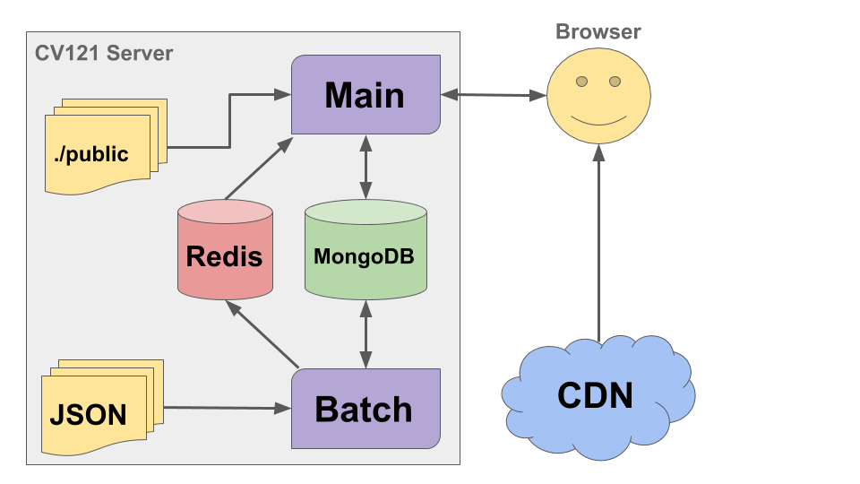

# CV121

## Description
CV121 is the premier Peer-2-Peer recruitment facilitator.

## System architecture

- The system is made up out of two applications called `Main` and `Batch`.
- `Main` is the application that exposes the [REST](https://en.wikipedia.org/wiki/Representational_state_transfer) endpoints and contains functions like database [CRUD](https://en.wikipedia.org/wiki/Create,_read,_update_and_delete) operations. It also handles user authentication via the [Passport](http://passportjs.org/) API. Authentication providers include Facebook, Google, LinkedIn and many more are possible.
- `Batch` is an application that is used to watch for changes in the datasets ([JSON](https://en.wikipedia.org/wiki/JSON)) and update the changes in the in-memory database ([Redis](https://en.wikipedia.org/wiki/Redis)). It also executes scheduled tasks that include sending e-mail notifications, handling database migrations and scan files in user's library for malware.
- The application relies heavily on that as much as possible of the client code is loaded from a [CDN](https://en.wikipedia.org/wiki/Content_delivery_network). The goal is to have all content expect index.html loaded from a CDN.
- Data is saved in a document-oriented database [MongoDB](https://en.wikipedia.org/wiki/MongoDB).
- The process manager used is [PM2](http://pm2.keymetrics.io/) with [Keymetrics](https://keymetrics.io/).

#### Philosophy
- We understand that software development is a process and that the perfect solution will not be implemented from the beginning. We create stable solutions that work and that can be implemented quickly and we refine them when we find better solutions.
- Use JavaScript in the back-end so that less experienced developers are able to join the team and contribute to the back-end development.
- Outsource as much as possible of the code to a CDN.
- We prefer not to handle security ourselves in the system, use 3rd party login providers.
- It should be as simple as possible to create an account.
- No code is holy, the best code that we can write is the test code ([E2E](https://en.wikipedia.org/wiki/End-to-end_principle),performance,security) since only then can we be comfortable when changing the application code without having to worry if it works - the test's should spot any issues.

#### Future and vision
- Adim tool for profile approval inspection (we need a tool where it would be simple to approve free-text fields that the user has updated).
- Use a container type environment using [Docker](https://www.docker.com/).
- Create E2E, security and performance tests.
- Setup an [Continuous integration](https://en.wikipedia.org/wiki/Continuous_integration) environment that is able to build, run tests and deploy the application to production. Current suggestion is to use [CircleCI](https://circleci.com/).
- Switch to [Angular 2](https://angular.io/) or the [React](https://facebook.github.io/react/) framework.
- Switch from JavaScript to [TypeScript](https://www.typescriptlang.org/).
- Setup clustering and load balancing, also consider using [Chef](https://www.chef.io/) and [Kubernetes](http://kubernetes.io/) for orchestration.

#### Programming
All changes should be developed in a new branch created from the `master` branch.

Branches use the following naming conventions
- `add/{something}` &rarr; When you are adding a completely new feature
- `update/{something}` &rarr; When you are iterating on an existing feature
- `fix/{something}` &rarr; When you are fixing something broken in a feature
- `try/{something}` &rarr; When you are trying out an idea and want feedback
- `release/v.{major}.{minor}.{patch}` &rarr; When releasing a new version

When a feature has been completed a pull request should be made. If the pull request passes the review then it will be merged into the `master` branch. The `master` always containes the source code that is currently in production.

## How to setup the developer environment
This is a first draft of how to setup the developer environment. The intention and goal for the future is to reduce the number of steps required to setup the environment for developers. Currently the vision is to create a container type environment that mimics the production environment, then no or very little setup would be required to setup a developer environment.

#### Step 1: Install [Node.js](https://en.wikipedia.org/wiki/Node.js) and [NPM](https://en.wikipedia.org/wiki/Npm_(software))
- Node.js is the runtime that drives our back-end. NPM is the package manager that we use to download dependencies.
- Either install the latest or the LTS version of Node.js (NPM is bundled with Node.js) from https://nodejs.org/.
- After the installation has completed, make sure that it was successful by opening a command prompt and executing the following commands: `node -v` and `npm -v`.

#### Step 2: Download the source code
- The VCS used in this project is Git.
- Currently the source code is public and can be downloaded from https://github.com/Axodoss/Ceramic.
- Use your favorite Git tool, here are some links to recommended tools: [Git](https://git-scm.com/), [GitHub Desktop](https://desktop.github.com/) or [GitKraken](https://www.gitkraken.com/).

#### Step 3: Install NPM modules
- Navigate to the source code folder (same folder as the file `package.json`) and execute the command `npm install`. This should download and install the required dependencies that the application uses.
- Verify that the application `gulp` is installed by running the command `gulp -v`. If the command does not return the tools version then install it by executing the following command `npm install -g gulp` and try again to run `gulp -v` afterwards.
- More modules can be found in the NPM repository at https://www.npmjs.com/.
- If you are running NPM behind a proxy server then you may have to [configure NPM when running behind a proxy](https://jjasonclark.com/how-to-setup-node-behind-web-proxy/).

#### Step 4: Generate SSH key
- At this point the application has been configured to run only behind a secure network, even when running the system locally. This may change in the future as we will have more time to setup a more user friendly developer environment.
- In order to run the application using SSL you need to generate two files: `local.key` and `local.crt`. These files should be located in the root of the source code folder.
- To generate the files you have make sure that OpenSSL (or similar tool) is installed on your computer. You can download OpenSSL from https://www.openssl.org/.
- Execute the following command to generate the required files: `openssl req -x509 -nodes -days 365 -newkey rsa:1024 -out local.crt -keyout local.key` (you may fiddle with the parameters if you like, for instance the encryption does not have to be 1024 bit long).

#### Step 5: Install MongoDB
- In the repository root directory create the following folders: `temp/database`
- The database used for the application is [MongoDB](https://en.wikipedia.org/wiki/MongoDB) which is a document-oriented database.
- Download and install the latest version of MongoDB from https://www.mongodb.com/.
- After installation you should be able to execute the following command: `mongod --version`

#### Step 6: Install Redis
- [Redis](https://en.wikipedia.org/wiki/Redis) is a fast access, in-memory key value store which we use to store datasets.
- Download and install the latest version of Redis from https://redis.io/.
- Windows users may install Redis via [Chocolatey](https://chocolatey.org/). Here is a link to [Redis in the Chocolatey repository](https://chocolatey.org/packages/redis-64).

#### Step 7: Install Elasticsearch
- [Elasticsearch](https://en.wikipedia.org/wiki/Elasticsearch) is the search engine that is planned to be used in our system. It has not been implemented yet so this step may be ignored for now.
- Elasticsearch can be downloaded from https://www.elastic.co/.

#### Step 8: Setup authentication
- At this time, setting up authentication when developing the application is very cumbersome.
- The simplest way is to use Facebook as the login provider, for this to work you need to set the environment variables `FACEBOOK_APP_ID` and `FACEBOOK_APP_SECRET`. The `FACEBOOK_APP_ID` is `1739265906354328`. `FACEBOOK_APP_SECRET` is a secret key and can't be added in this document.

#### Step 9: Running the application
To start the application run the following commands in separate windows from the source code root folder:

- `start-mongo` (if not already running as a service, this will start MongoDB)
- `start-redis` (if not already running as a service, this will start Redis)
- `gulp watch` (this will build the application and begin watching files for changes and rebuild the system if any source file is updated)
- `gulp batch` (this will start the batch application)
- `gulp serve` (this will start the back-end (main) application)

#### Step 10: Filling the database with testdata
- Goto the folder `source/tools/dev` in the project
- Execute the following command: `node cvc-devtool.js -c ../../../config.json -f testdata.json`

#### Step 11: Open the application
- The application should now be available at [https://localhost:9010/#/](https://localhost:9010/#/)

#### Other useful tools
- [ConEmu](https://conemu.github.io/) (Windows) or [iTerm2](http://iterm2.com/) (MacOS) 
- [Atom](https://atom.io/)
- [Sublime Text](http://www.sublimetext.com/)
- [Mongotron](http://mongotron.io/#/)
- [JSONLint](http://jsonlint.com/)

#### Environment variables
##### Runtime environment
* **SESSION_KEY** = Express API session (not required, loads from config when developing)
* **FACEBOOK_APP_ID** = Facebook app id (required when using Facebook as the authentication provider)
* **FACEBOOK_APP_SECRET** = Facebook secret id (required when using Facebook as the authentication provider)
* **DB_USERNAME** = MongoDB user (not required, loads from config when developing)
* **DB_PASSWORD** = MongoDB password (not required, loads from config when developing)

##### Continuous integration
* **PUBLISH_URL** = Target server URL (not required when developing)
* **PUBLISH_USER** = Target server user name (not required when developing)
* **PUBLISH_PASSWORD** = Target server password (not required when developing)
* **PUBLISH_PATH** = Path to where the build should be put in the target server (not required when developing)
